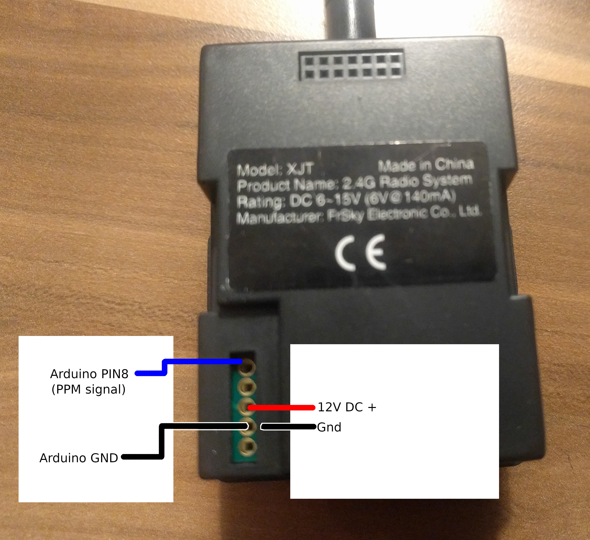

# ppm_rc_controller Arduino project

Allows to control a RC transmitter module using an Arduion. The communication to the Arduino is ASCII based over USB-serial.

## Getting started

* Connect your transmitter module (see Schematics below).
* Upload the project [ppm_rc_controller.ino](ppm_rc_controller.ino) to your development board
* Connect a serial terminal and send a "h" which gives a overview of all commands including setting channel values.

## Schematics

* Connect Pin8 to the signal pin of the transmitter module.
* Connect power supply or battery to the VBat and GND pin of the transmitter module.
* Ensure common ground!
* Connect your computer using a micro-USB cable to the arduino.

